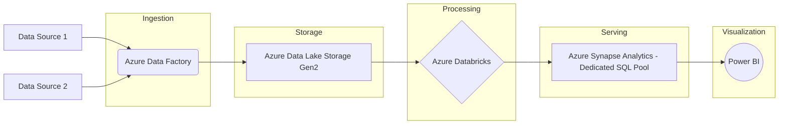

# Azure Data Architecture Plan: [Project Name]

## 1. Overview

**Project:** `[Project Name]`
**Use Case / Business Goals:** `[Use Case / Business Goals Summary]`
**Date Generated:** `[Date]`
**Generated By:** Azure Data Architecture Generator

This document outlines the proposed Azure data architecture designed to meet the specified requirements. It includes a list of selected Azure services, their configuration notes, a visual diagram, and high-level setup steps.

## 2. Selected Azure Services

The following Azure services have been selected for this architecture:

### 2.1. Data Ingestion
<!-- INGESTION_SERVICES_TABLE_START -->
| Service Name     | Role in Architecture                      | Key Configuration Notes                                  | Justification                                      |
| ---------------- | ----------------------------------------- | -------------------------------------------------------- | -------------------------------------------------- |
| `[Service Name]` | `[Role of Ingestion Service 1]`           | `[Key Configuration Notes for Ingestion Service 1]`      | `[Justification for Ingestion Service 1]`          |
| `[Service Name]` | `[Role of Ingestion Service 2 (Optional)]`| `[Key Configuration Notes for Ingestion Service 2]`      | `[Justification for Ingestion Service 2 (Optional)]` |
<!-- INGESTION_SERVICES_TABLE_END -->

### 2.2. Data Storage
<!-- STORAGE_SERVICES_TABLE_START -->
| Service Name     | Role in Architecture        | Key Configuration Notes                      | Justification                                |
| ---------------- | --------------------------- | -------------------------------------------- | -------------------------------------------- |
| `[Service Name]` | `[Role of Storage Service 1]` | `[Key Configuration Notes for Storage Service 1]` | `[Justification for Storage Service 1]`    |
| `[Service Name]` | `[Role of Storage Service 2 (Optional)]` | `[Key Configuration Notes for Storage Service 2]` | `[Justification for Storage Service 2 (Optional)]` |
<!-- STORAGE_SERVICES_TABLE_END -->

### 2.3. Data Processing & Transformation
<!-- PROCESSING_SERVICES_TABLE_START -->
| Service Name     | Role in Architecture           | Key Configuration Notes                         | Justification                                   |
| ---------------- | ------------------------------ | ----------------------------------------------- | ----------------------------------------------- |
| `[Service Name]` | `[Role of Processing Service 1]` | `[Key Configuration Notes for Processing Service 1]` | `[Justification for Processing Service 1]`      |
| `[Service Name]` | `[Role of Processing Service 2 (Optional)]` | `[Key Configuration Notes for Processing Service 2]` | `[Justification for Processing Service 2 (Optional)]` |
<!-- PROCESSING_SERVICES_TABLE_END -->

### 2.4. Analytical Data Serving / Data Warehousing
<!-- ANALYTICAL_SERVING_SERVICES_TABLE_START -->
| Service Name     | Role in Architecture        | Key Configuration Notes                      | Justification                                |
| ---------------- | --------------------------- | -------------------------------------------- | -------------------------------------------- |
| `[Service Name]` | `[Role of Analytics Service 1]` | `[Key Configuration Notes for Analytics Service 1]` | `[Justification for Analytics Service 1]`    |
<!-- ANALYTICAL_SERVING_SERVICES_TABLE_END -->

### 2.5. Visualization & Reporting
<!-- VISUALIZATION_SERVICES_TABLE_START -->
| Service Name     | Role in Architecture             | Key Configuration Notes                           | Justification                                     |
| ---------------- | -------------------------------- | ------------------------------------------------- | ------------------------------------------------- |
| `[Service Name]` | `[Role of Visualization Service 1]`| `[Key Configuration Notes for Visualization Service 1]` | `[Justification for Visualization Service 1]` |
<!-- VISUALIZATION_SERVICES_TABLE_END -->

*(Note: Categories and services will be dynamically populated based on requirements. Some categories or multiple services within a category may not always be present.)*

## 3. Architecture Diagram (Mermaid.js)
<!-- MERMAID_DIAGRAM_START -->

<!-- MERMAID_DIAGRAM_END -->

*(Note: This is a sample diagram. The actual diagram will be generated based on the selected services and their relationships.)*

## 4. High-Level Setup Steps
<!-- HIGH_LEVEL_SETUP_STEPS_START -->
1.  **Provision Core Infrastructure:**
    *   Create a Resource Group in Azure: `[Resource Group Name]` in `[Azure Region]`.
    *   Set up networking (VNet, subnets, NSGs) as required: `[Networking Details/Considerations]`.
2.  **Deploy Data Storage:**
    *   Provision `[Storage Service 1 Name]` (`[Storage Service 1 Type]`) with the following considerations: `[Key Configuration Notes for Storage Service 1]`.
    *   (If applicable) Provision `[Storage Service 2 Name]` (`[Storage Service 2 Type]`) with considerations: `[Key Configuration Notes for Storage Service 2]`.
3.  **Set Up Data Ingestion:**
    *   Deploy and configure `[Ingestion Service 1 Name]` to connect to `[Data Sources]` and load data into `[Target Storage/Processing Service]`. Key settings: `[Key Configuration Notes for Ingestion Service 1]`.
    *   (If applicable) Deploy and configure `[Ingestion Service 2 Name]`.
4.  **Configure Data Processing:**
    *   Set up `[Processing Service 1 Name]` for transformations. Notebooks/scripts to be developed: `[Processing Logic Summary]`. Key settings: `[Key Configuration Notes for Processing Service 1]`.
    *   (If applicable) Set up `[Processing Service 2 Name]`.
5.  **Deploy Analytical Layer:**
    *   Provision and configure `[Analytics Service 1 Name]`. Load processed data from `[Source for Analytics Layer]`. Key settings: `[Key Configuration Notes for Analytics Service 1]`.
6.  **Develop Visualizations:**
    *   Connect `[Visualization Service 1 Name]` to `[Analytics Service 1 Name]`. Develop reports and dashboards for `[Target Audience/Reports]`.
<!-- HIGH_LEVEL_SETUP_STEPS_END -->

*(Note: These are high-level steps. Detailed ARM templates, Bicep files, or Terraform scripts will be provided by the IaC Generation Module in a future version.)*

## 5. Infrastructure as Code (IaC) Suggestions
<!-- IAC_SUGGESTIONS_START -->
<!-- Placeholder for IaC suggestions -->
<!-- IAC_SUGGESTIONS_END -->

## 6. Next Steps & Considerations
<!-- NEXT_STEPS_CONSIDERATIONS_START -->
*   **Detailed Configuration:** Each Azure service listed will require further detailed configuration based on specific performance, security, and cost requirements. Refer to official Azure documentation.
*   **Security:** Implement robust security measures, including identity management (Azure AD), network security (NSGs, Private Endpoints), data encryption (at rest and in transit), and secrets management (Azure Key Vault). `[Specific Security Recommendations]`
*   **Monitoring & Logging:** Configure Azure Monitor and Log Analytics for all services to track performance, diagnose issues, and set up alerts. `[Specific Monitoring Recommendations]`
*   **Cost Management:** Regularly review Azure Cost Management to monitor and optimize spending. Select appropriate service tiers and utilize reservations or spot instances where applicable. `[Specific Cost Optimization Hints]`
*   **Data Governance:** Implement data governance practices using Microsoft Purview for data discovery, classification, and lineage tracking, especially if dealing with sensitive data.
*   **Scalability & Performance Testing:** Conduct thorough performance testing and plan for scalability based on expected data volume growth and query loads.
*   **IaC Development:** (Future) Utilize the generated IaC scripts for automated and repeatable deployments.
<!-- NEXT_STEPS_CONSIDERATIONS_END -->

This document provides a starting point for your Azure data architecture. Fine-tuning and continuous improvement will be necessary as your requirements evolve.
---
*Disclaimer: This architecture is a recommendation based on the provided inputs. Always validate against your specific business, technical, and security requirements.*
